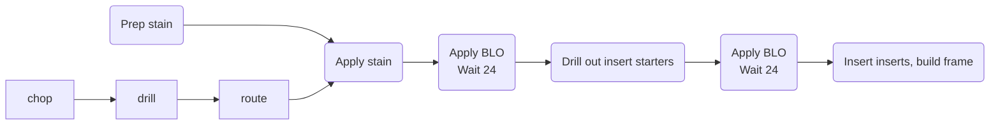

### Prep stain
- [!] do not tightly seal container
- Finely cut #000 SS wool into three-to-one vinegar solution
- Allow three days, try pinholed tinfoil top to allow gas escape
- Gently swirl on occasion, opening top may increase red colorsation

### Chop
- Cut to length using table, miter, jig, or hand saws

### Drill
- Drill all holes, counter sink, and insert starter holes

### Route
- Remove all edges

### Apply stain
- Use brush, do it early in the day to allow for evaporation, possible dryer use
- Apply BLO by end of day

### Apply BLO
- [!] Do not pile BLO soaked fabric
- Try sprayer, 2 coats, 24 hour space
- Insert starter holes are drilled out between 1st & second coat to prevent cracking

## PPE
- Eyepro/ faceshield
- Mask or ventilation
- Gloves, rubber and cut resistant
