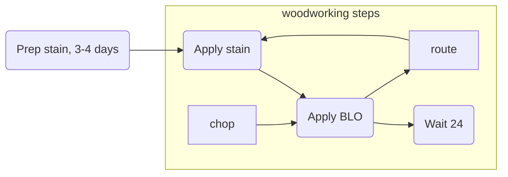

```mermaid

flowchart LR

    id1(Prep stain, 3-4 days)-->id2(Apply stain)
    
    subgraph ide1 [woodworking steps]
    
    chop-->id3(drill, thru and insert starters)
    
    id3-->route
    
    route-->id2
    
    id2-->id3(Apply BLO)
    
    id3-->id4(Wait 24)
    
    end
    
```
